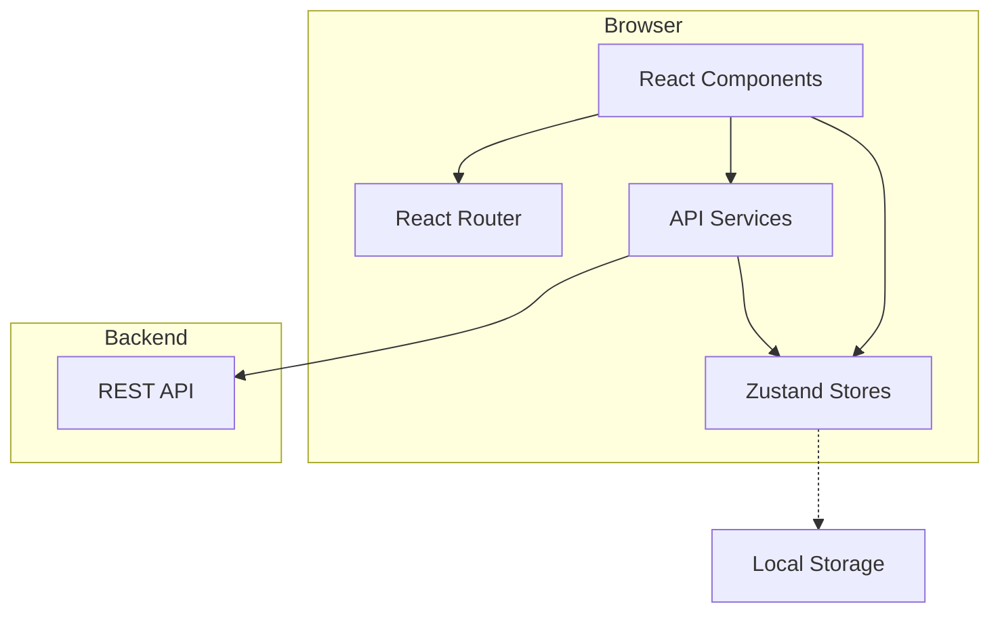

# Design Document

## Overview

iSelect 分布式计算平台前端是一个基于 React 18 和 TypeScript 的单页应用（SPA），采用现代化的前端技术栈构建。系统通过 RESTful API 与后端通信，提供直观的用户界面用于管理分布式计算资源、上传数据文件、创建和监控计算任务。

### Technology Stack

- **框架**: React 18 with TypeScript
- **构建工具**: Vite
- **路由**: React Router v6
- **状态管理**: Zustand
- **UI 组件库**: Ant Design 5.x
- **图表库**: Recharts
- **HTTP 客户端**: Axios
- **样式**: CSS Modules + Ant Design 主题定制
- **实时更新**: 轮询机制（Polling）

### Design Principles

1. **组件化**: 构建可复用的 UI 组件，遵循单一职责原则
2. **类型安全**: 充分利用 TypeScript 提供类型检查和智能提示
3. **状态分离**: 使用 Zustand 进行全局状态管理，保持组件状态简洁
4. **API 抽象**: 通过 Service 层封装所有 API 调用
5. **响应式设计**: 支持桌面和移动设备
6. **主题一致性**: 统一的绿色主题设计系统
7. **性能优化**: 使用 React.memo、useMemo、useCallback 优化渲染性能

## Architecture


### System Architecture Diagram



### Application Flow

1. **初始化流程**: 应用加载 → 检查 localStorage 中的 token → 恢复认证状态 → 路由守卫判断 → 渲染对应页面
2. **认证流程**: 用户登录 → API 验证 → 存储 token → 更新 authStore → 重定向到仪表盘
3. **数据获取流程**: 组件挂载 → 调用 Service 方法 → 发起 API 请求 → 更新 Store → 组件重新渲染
4. **实时更新流程**: 组件挂载 → 启动轮询定时器 → 定期调用 API → 更新 Store → 组件卸载时清除定时器

## Components and Interfaces

### Component Hierarchy


```
App
├── ConfigProvider (Ant Design Theme)
├── BrowserRouter
    ├── Routes
        ├── Public Routes
        │   ├── Login
        │   └── Register
        └── Protected Routes (ProtectedLayout)
            ├── MainLayout
            │   ├── Header
            │   ├── Sidebar
            │   └── Content
            │       ├── Dashboard
            │       ├── WorkerList
            │       ├── WorkerDetail
            │       ├── FileManagement
            │       ├── TaskList
            │       ├── TaskCreate
            │       ├── TaskDetail
            │       └── Settings
```

### Core Components

#### 1. Layout Components

**MainLayout**
- 职责: 提供主应用布局结构
- Props: `children: ReactNode`
- 状态: `sidebarCollapsed: boolean`
- 功能: 响应式侧边栏折叠/展开

**Header**
- 职责: 显示顶部导航栏
- Props: 无
- 状态: 从 authStore 获取用户信息
- 功能: 显示 Logo、用户信息、登出按钮

**Sidebar**

- 职责: 显示侧边导航菜单
- Props: `collapsed: boolean`
- 状态: 当前路由路径
- 功能: 菜单项导航、高亮当前页面

#### 2. Authentication Components

**Login**
- 职责: 用户登录表单
- Props: 无
- 状态: `formData: { client_id, username, password }`, `loading: boolean`
- 功能: 表单验证、调用登录 API、错误处理

**Register**
- 职责: 公司注册表单
- Props: 无
- 状态: `formData: { client_name, username, password }`, `loading: boolean`
- 功能: 表单验证、调用注册 API、自动登录

#### 3. Dashboard Components

**Dashboard**
- 职责: 仪表盘主页面
- Props: 无
- 状态: 从 workerStore 和 taskStore 获取数据
- 子组件: StatCard, ResourceChart, TaskStatusChart, RealtimeTaskList

**StatCard**
- 职责: 显示统计数据卡片
- Props: `title: string, value: number, icon: ReactNode, color: string`
- 功能: 展示单个统计指标


**ResourceChart**
- 职责: 显示资源使用趋势折线图
- Props: `data: ResourceData[]`
- 功能: 使用 Recharts 渲染折线图

**TaskStatusChart**
- 职责: 显示任务状态分布饼图
- Props: `data: TaskStatusData[]`
- 功能: 使用 Recharts 渲染饼图

#### 4. Worker Components

**WorkerList**
- 职责: Worker 列表页面
- Props: 无
- 状态: 从 workerStore 获取数据，`searchText: string`, `statusFilter: string`
- 子组件: WorkerTable, SearchBar, FilterDropdown

**WorkerTable**
- 职责: Worker 数据表格
- Props: `workers: Worker[], loading: boolean`
- 功能: 展示 Worker 列表、状态指示器、资源使用进度条

**WorkerDetail**
- 职责: Worker 详情页面
- Props: 无（从路由参数获取 worker_id）
- 状态: `workerDetail: Worker`, `resourceHistory: ResourceData[]`
- 子组件: WorkerCard, ResourceMonitor

**WorkerCard**
- 职责: Worker 基本信息卡片
- Props: `worker: Worker`
- 功能: 展示 Worker 配置信息


**ResourceMonitor**
- 职责: 实时资源监控图表
- Props: `data: ResourceData[], type: 'cpu' | 'memory' | 'vram'`
- 功能: 使用 Recharts 渲染实时资源使用率

#### 5. File Components

**FileManagement**
- 职责: 文件管理页面
- Props: 无
- 状态: 从 fileStore 获取数据
- 子组件: FileUpload, FileList

**FileUpload**
- 职责: 文件上传组件
- Props: `onUploadSuccess: () => void`
- 状态: `uploading: boolean`, `progress: number`
- 功能: 拖拽上传、文件验证、进度显示

**FileList**
- 职责: 文件列表表格
- Props: `files: FileInfo[]`
- 功能: 展示文件列表、预览、下载

#### 6. Task Components

**TaskList**
- 职责: 任务列表页面
- Props: 无
- 状态: 从 taskStore 获取数据，`searchText: string`, `statusFilter: string`
- 子组件: TaskTable, SearchBar, FilterDropdown

**TaskTable**
- 职责: 任务数据表格
- Props: `tasks: Task[], loading: boolean`
- 功能: 展示任务列表、状态徽章


**TaskCreate**
- 职责: 任务创建页面
- Props: 无
- 状态: `formData: { function_id, file_id, task_volume }`, `loading: boolean`
- 功能: 表单验证、调用任务创建 API

**TaskDetail**
- 职责: 任务详情页面
- Props: 无（从路由参数获取 task_id）
- 状态: 从 taskStore 获取 currentTask
- 子组件: TaskInfo, TaskProgress, SubtaskTable

**TaskInfo**
- 职责: 任务基本信息卡片
- Props: `task: Task`
- 功能: 展示任务元数据

**TaskProgress**
- 职责: 任务整体进度条
- Props: `progress: number`
- 功能: 可视化展示任务进度

**SubtaskTable**
- 职责: 子任务列表表格
- Props: `subtasks: Subtask[]`
- 功能: 展示子任务详情、进度、状态

#### 7. Common Components

**StatusBadge**
- 职责: 状态徽章
- Props: `status: string, text?: string`
- 功能: 根据状态显示不同颜色的徽章


**ProgressBar**
- 职责: 进度条组件
- Props: `percent: number, showInfo?: boolean, status?: string`
- 功能: 展示进度百分比

**DataTable**
- 职责: 通用数据表格
- Props: `columns: ColumnType[], dataSource: any[], loading: boolean`
- 功能: 基于 Ant Design Table 的封装

**ProtectedRoute**
- 职责: 路由守卫
- Props: `children: ReactNode`
- 功能: 验证认证状态，未认证则重定向到登录页

## Data Models

### TypeScript Interfaces

#### Authentication Types

```typescript
interface AuthState {
  token: string | null;
  clientId: string | null;
  userId: string | null;
  username: string | null;
  isAuthenticated: boolean;
  login: (credentials: LoginCredentials) => Promise<void>;
  logout: () => void;
  registerClient: (data: RegisterClientData) => Promise<void>;
}

interface LoginCredentials {
  client_id: string;
  username: string;
  password: string;
}

interface RegisterClientData {
  client_name: string;
  username: string;
  password: string;
}
```


#### Worker Types

```typescript
interface Worker {
  worker_id: string;
  client_id: string;
  cpu_cores: number;
  cpu_frequency_ghz: number;
  memory_gb: number;
  vram_gb: number;
  cpu_usage_percent: number;
  memory_usage_percent: number;
  vram_usage_percent: number;
  last_heartbeat: string;
  status?: 'online' | 'offline' | 'busy';
}

interface WorkerState {
  workers: Worker[];
  onlineCount: number;
  availableCount: number;
  loading: boolean;
  fetchWorkers: () => Promise<void>;
  startPolling: () => void;
  stopPolling: () => void;
}

interface ResourceData {
  timestamp: string;
  cpu: number;
  memory: number;
  vram: number;
}
```

#### Task Types

```typescript
interface Task {
  task_id: string;
  function_id: string;
  user_id: string;
  file_url: string;
  task_status: 'init' | 'assigned' | 'running' | 'success' | 'failure' | 'retrying';
  subtask_list: Subtask[];
  retry_times: number;
  current_round: number;
  max_rounds: number;
  task_volume: number;
  result?: string;
  created_at: string;
  completed_at?: string;
}
```


```typescript
interface Subtask {
  subtask_id: string;
  worker_id: string;
  start_index: number;
  end_index: number;
  subtask_status: 'init' | 'waiting' | 'computing' | 'success' | 'failure';
  progress: string;
  result?: number[];
  error?: string;
}

interface TaskState {
  tasks: Task[];
  currentTask: Task | null;
  loading: boolean;
  fetchTasks: () => Promise<void>;
  createTask: (data: CreateTaskData) => Promise<string>;
  fetchTaskDetail: (taskId: string) => Promise<void>;
  startPolling: (taskId: string) => void;
  stopPolling: () => void;
}

interface CreateTaskData {
  user_id: string;
  function_id: string;
}
```

#### File Types

```typescript
interface FileInfo {
  file_id: string;
  file_name: string;
  file_size: number;
  file_url: string;
  uploaded_at: string;
  user_id: string;
}

interface FileState {
  files: FileInfo[];
  loading: boolean;
  uploadFile: (file: File) => Promise<void>;
  fetchFiles: () => Promise<void>;
}
```

## Error Handling


### Error Handling Strategy

#### 1. API Error Handling

**Axios Response Interceptor**
```typescript
api.interceptors.response.use(
  (response) => response,
  (error) => {
    if (error.response) {
      switch (error.response.status) {
        case 401:
          // 清除认证信息，重定向到登录页
          authStore.getState().logout();
          window.location.href = '/login';
          break;
        case 400:
          // 显示后端返回的错误消息
          message.error(error.response.data.message || 'Bad request');
          break;
        case 404:
          message.error('Resource not found');
          break;
        case 500:
          message.error('Server error, please try again later');
          break;
        default:
          message.error('An error occurred');
      }
    } else if (error.request) {
      // 网络错误
      message.error('Network error, please check your connection');
    } else {
      message.error('Request failed');
    }
    return Promise.reject(error);
  }
);
```

#### 2. Form Validation

使用 Ant Design Form 的内置验证规则：
- 必填字段验证
- 邮箱格式验证
- 密码强度验证
- 文件类型和大小验证


#### 3. Component Error Boundaries

```typescript
class ErrorBoundary extends React.Component {
  componentDidCatch(error, errorInfo) {
    console.error('Error caught by boundary:', error, errorInfo);
    message.error('Something went wrong. Please refresh the page.');
  }
  
  render() {
    return this.props.children;
  }
}
```

#### 4. Loading States

- 使用 Ant Design Spin 组件显示加载状态
- 使用 Skeleton 组件显示骨架屏
- 在按钮上显示 loading 属性

## Testing Strategy

### Unit Testing

**测试工具**: Vitest + React Testing Library

**测试范围**:
1. **Utility Functions**: 格式化函数、验证函数
2. **Custom Hooks**: usePolling、useAuth
3. **Store Actions**: Zustand store 的 actions
4. **Component Logic**: 组件的业务逻辑

**示例测试**:
```typescript
describe('formatFileSize', () => {
  it('should format bytes to MB', () => {
    expect(formatFileSize(2621440)).toBe('2.50 MB');
  });
});
```


### Component Testing

**测试范围**:
1. **Common Components**: StatusBadge、ProgressBar、DataTable
2. **Form Components**: Login、Register、TaskCreate
3. **List Components**: WorkerList、TaskList、FileList

**示例测试**:
```typescript
describe('StatusBadge', () => {
  it('should render success status with green color', () => {
    const { getByText } = render(<StatusBadge status="success" text="Success" />);
    expect(getByText('Success')).toBeInTheDocument();
  });
});
```

### Integration Testing

**测试范围**:
1. **认证流程**: 登录 → 存储 token → 访问受保护路由
2. **任务创建流程**: 上传文件 → 创建任务 → 查看任务详情
3. **实时更新**: 启动轮询 → 更新数据 → 停止轮询

### E2E Testing (Optional)

**测试工具**: Playwright

**测试场景**:
1. 用户注册和登录完整流程
2. 文件上传和任务创建流程
3. 任务监控和结果下载流程

## API Service Layer Design

### Base API Configuration

```typescript
// services/api.ts
import axios from 'axios';

const api = axios.create({
  baseURL: import.meta.env.VITE_API_BASE_URL || 'http://localhost:8080/api',
  timeout: 10000,
});
```


```typescript
// Request interceptor
api.interceptors.request.use((config) => {
  const token = localStorage.getItem('token');
  if (token) {
    config.headers.Authorization = `Bearer ${token}`;
  }
  return config;
});

export default api;
```

### Service Modules

#### Client Service

```typescript
// services/clientService.ts
import api from './api';

export const clientService = {
  register: async (data: RegisterClientData) => {
    const response = await api.post('/client/register', data);
    return response.data;
  },
  
  registerUser: async (data: RegisterUserData) => {
    const response = await api.post('/user/register', data);
    return response.data;
  },
  
  login: async (data: LoginCredentials) => {
    const response = await api.post('/user/login', data);
    return response.data;
  },
};
```

#### Worker Service

```typescript
// services/workerService.ts
import api from './api';

export const workerService = {
  getAll: async () => {
    const response = await api.get('/workers/status');
    return response.data;
  },
  
  getByClientId: async (clientId: string) => {
    const response = await api.get(`/workers/status/${clientId}`);
    return response.data;
  },
};
```


#### Task Service

```typescript
// services/taskService.ts
import api from './api';

export const taskService = {
  execute: async (data: CreateTaskData) => {
    const response = await api.post('/task/execute', data);
    return response.data;
  },
  
  getStatus: async (taskId: string) => {
    const response = await api.get(`/task/status/${taskId}`);
    return response.data;
  },
};
```

#### File Service

```typescript
// services/fileService.ts
import api from './api';

export const fileService = {
  upload: async (file: File, clientId: string, userId: string) => {
    const formData = new FormData();
    formData.append('file', file);
    formData.append('client_id', clientId);
    formData.append('user_id', userId);
    
    const response = await api.post('/file/upload', formData, {
      headers: { 'Content-Type': 'multipart/form-data' },
    });
    return response.data;
  },
};
```

## State Management Design

### Zustand Store Architecture

#### Auth Store

```typescript
// stores/authStore.ts
import { create } from 'zustand';
import { clientService } from '../services/clientService';

interface AuthState {
  token: string | null;
  clientId: string | null;
  userId: string | null;
  username: string | null;
  isAuthenticated: boolean;
  login: (credentials: LoginCredentials) => Promise<void>;
  logout: () => void;
  registerClient: (data: RegisterClientData) => Promise<void>;
  initAuth: () => void;
}
```


```typescript
export const useAuthStore = create<AuthState>((set) => ({
  token: null,
  clientId: null,
  userId: null,
  username: null,
  isAuthenticated: false,
  
  login: async (credentials) => {
    const response = await clientService.login(credentials);
    const { token } = response;
    
    localStorage.setItem('token', token);
    localStorage.setItem('clientId', credentials.client_id);
    localStorage.setItem('username', credentials.username);
    
    set({
      token,
      clientId: credentials.client_id,
      username: credentials.username,
      isAuthenticated: true,
    });
  },
  
  logout: () => {
    localStorage.clear();
    set({
      token: null,
      clientId: null,
      userId: null,
      username: null,
      isAuthenticated: false,
    });
  },
  
  registerClient: async (data) => {
    const response = await clientService.register(data);
    const { token, client_id, user_id } = response;
    
    localStorage.setItem('token', token);
    localStorage.setItem('clientId', client_id);
    localStorage.setItem('userId', user_id);
    localStorage.setItem('username', data.username);
    
    set({
      token,
      clientId: client_id,
      userId: user_id,
      username: data.username,
      isAuthenticated: true,
    });
  },
  
  initAuth: () => {
    const token = localStorage.getItem('token');
    const clientId = localStorage.getItem('clientId');
    const userId = localStorage.getItem('userId');
    const username = localStorage.getItem('username');
    
    if (token) {
      set({ token, clientId, userId, username, isAuthenticated: true });
    }
  },
}));
```


#### Worker Store

```typescript
// stores/workerStore.ts
import { create } from 'zustand';
import { workerService } from '../services/workerService';

interface WorkerState {
  workers: Worker[];
  onlineCount: number;
  availableCount: number;
  loading: boolean;
  pollingInterval: NodeJS.Timeout | null;
  fetchWorkers: () => Promise<void>;
  startPolling: (clientId: string, interval?: number) => void;
  stopPolling: () => void;
}

export const useWorkerStore = create<WorkerState>((set, get) => ({
  workers: [],
  onlineCount: 0,
  availableCount: 0,
  loading: false,
  pollingInterval: null,
  
  fetchWorkers: async () => {
    set({ loading: true });
    try {
      const response = await workerService.getByClientId();
      const workers = response.workers.map((w: Worker) => ({
        ...w,
        status: isWorkerOnline(w.last_heartbeat) ? 'online' : 'offline',
      }));
      
      const onlineCount = workers.filter((w) => w.status === 'online').length;
      const availableCount = workers.filter((w) => w.status === 'online' && !w.busy).length;
      
      set({ workers, onlineCount, availableCount });
    } catch (error) {
      console.error('Failed to fetch workers:', error);
    } finally {
      set({ loading: false });
    }
  },
  
  startPolling: (clientId, interval = 5000) => {
    const { stopPolling, fetchWorkers } = get();
    stopPolling();
    
    fetchWorkers(clientId);
    const pollingInterval = setInterval(() => fetchWorkers(clientId), interval);
    set({ pollingInterval });
  },
  
  stopPolling: () => {
    const { pollingInterval } = get();
    if (pollingInterval) {
      clearInterval(pollingInterval);
      set({ pollingInterval: null });
    }
  },
}));

function isWorkerOnline(lastHeartbeat: string): boolean {
  const now = new Date().getTime();
  const heartbeat = new Date(lastHeartbeat).getTime();
  return now - heartbeat < 30000; // 30 seconds
}
```


#### Task Store

```typescript
// stores/taskStore.ts
import { create } from 'zustand';
import { taskService } from '../services/taskService';

interface TaskState {
  tasks: Task[];
  currentTask: Task | null;
  loading: boolean;
  pollingInterval: NodeJS.Timeout | null;
  createTask: (data: CreateTaskData) => Promise<string>;
  fetchTaskDetail: (taskId: string) => Promise<void>;
  startPolling: (taskId: string, interval?: number) => void;
  stopPolling: () => void;
}

export const useTaskStore = create<TaskState>((set, get) => ({
  tasks: [],
  currentTask: null,
  loading: false,
  pollingInterval: null,
  
  createTask: async (data) => {
    const response = await taskService.execute(data);
    return response.task_id;
  },
  
  fetchTaskDetail: async (taskId) => {
    set({ loading: true });
    try {
      const response = await taskService.getStatus(taskId);
      set({ currentTask: response.task });
    } catch (error) {
      console.error('Failed to fetch task detail:', error);
    } finally {
      set({ loading: false });
    }
  },
  
  startPolling: (taskId, interval = 3000) => {
    const { stopPolling, fetchTaskDetail } = get();
    stopPolling();
    
    fetchTaskDetail(taskId);
    const pollingInterval = setInterval(() => {
      fetchTaskDetail(taskId);
      
      // Stop polling if task is completed
      const { currentTask } = get();
      if (currentTask && ['success', 'failure'].includes(currentTask.task_status)) {
        stopPolling();
      }
    }, interval);
    
    set({ pollingInterval });
  },
  
  stopPolling: () => {
    const { pollingInterval } = get();
    if (pollingInterval) {
      clearInterval(pollingInterval);
      set({ pollingInterval: null });
    }
  },
}));
```


#### File Store

```typescript
// stores/fileStore.ts
import { create } from 'zustand';
import { fileService } from '../services/fileService';

interface FileState {
  files: FileInfo[];
  loading: boolean;
  uploadFile: (file: File, clientId: string, userId: string) => Promise<void>;
}

export const useFileStore = create<FileState>((set) => ({
  files: [],
  loading: false,
  
  uploadFile: async (file, clientId, userId) => {
    set({ loading: true });
    try {
      const response = await fileService.upload(file, clientId, userId);
      set((state) => ({
        files: [...state.files, {
          file_id: response.file_id,
          file_name: file.name,
          file_size: file.size,
          file_url: response.file_url,
          uploaded_at: new Date().toISOString(),
          user_id: userId,
        }],
      }));
    } catch (error) {
      console.error('Failed to upload file:', error);
      throw error;
    } finally {
      set({ loading: false });
    }
  },
}));
```

## Theme Configuration

### Ant Design Theme Customization

```typescript
// theme/index.ts
import { ThemeConfig } from 'antd';

export const greenTheme: ThemeConfig = {
  token: {
    colorPrimary: '#52c41a',
    colorSuccess: '#52c41a',
    colorWarning: '#faad14',
    colorError: '#f5222d',
    colorInfo: '#13c2c2',
    colorLink: '#52c41a',
    borderRadius: 6,
    fontSize: 14,
    fontFamily: '-apple-system, BlinkMacSystemFont, "Segoe UI", Roboto, "Helvetica Neue", Arial',
  },
  components: {
    Button: {
      colorPrimary: '#52c41a',
      algorithm: true,
    },
    Table: {
      headerBg: '#f6ffed',
      headerColor: '#389e0d',
    },
    Card: {
      colorBorderSecondary: '#b7eb8f',
    },
    Progress: {
      defaultColor: '#52c41a',
    },
    Layout: {
      headerBg: '#389e0d',
      siderBg: '#f6ffed',
    },
  },
};
```


### Color Palette

```typescript
// theme/colors.ts
export const colors = {
  primary: {
    main: '#52c41a',
    light: '#95de64',
    dark: '#389e0d',
    lighter: '#f6ffed',
  },
  secondary: {
    main: '#13c2c2',
    light: '#87e8de',
    dark: '#08979c',
  },
  status: {
    success: '#52c41a',
    warning: '#faad14',
    error: '#f5222d',
    info: '#1890ff',
    processing: '#13c2c2',
  },
  neutral: {
    bg: '#f0f2f5',
    card: '#ffffff',
    border: '#d9d9d9',
    text: '#262626',
    textSecondary: '#8c8c8c',
  },
};
```

## Routing Configuration

### Route Structure

```typescript
// App.tsx
import { BrowserRouter, Routes, Route, Navigate } from 'react-router-dom';
import { ConfigProvider } from 'antd';
import { greenTheme } from './theme';
import ProtectedRoute from './components/ProtectedRoute';
import MainLayout from './layouts/MainLayout';
import Login from './pages/auth/Login';
import Register from './pages/auth/Register';
import Dashboard from './pages/dashboard/Dashboard';
import WorkerList from './pages/workers/WorkerList';
import WorkerDetail from './pages/workers/WorkerDetail';
import FileManagement from './pages/files/FileManagement';
import TaskList from './pages/tasks/TaskList';
import TaskCreate from './pages/tasks/TaskCreate';
import TaskDetail from './pages/tasks/TaskDetail';
import Settings from './pages/settings/Settings';

function App() {
  return (
    <ConfigProvider theme={greenTheme}>
      <BrowserRouter>
        <Routes>
          <Route path="/login" element={<Login />} />
          <Route path="/register" element={<Register />} />
          
          <Route element={<ProtectedRoute><MainLayout /></ProtectedRoute>}>
            <Route path="/" element={<Navigate to="/dashboard" replace />} />
            <Route path="/dashboard" element={<Dashboard />} />
            <Route path="/workers" element={<WorkerList />} />
            <Route path="/workers/:id" element={<WorkerDetail />} />
            <Route path="/files" element={<FileManagement />} />
            <Route path="/tasks" element={<TaskList />} />
            <Route path="/tasks/create" element={<TaskCreate />} />
            <Route path="/tasks/:id" element={<TaskDetail />} />
            <Route path="/settings" element={<Settings />} />
          </Route>
        </Routes>
      </BrowserRouter>
    </ConfigProvider>
  );
}

export default App;
```


### Protected Route Implementation

```typescript
// components/ProtectedRoute.tsx
import { Navigate } from 'react-router-dom';
import { useAuthStore } from '../stores/authStore';

interface ProtectedRouteProps {
  children: React.ReactNode;
}

const ProtectedRoute: React.FC<ProtectedRouteProps> = ({ children }) => {
  const isAuthenticated = useAuthStore((state) => state.isAuthenticated);
  
  if (!isAuthenticated) {
    return <Navigate to="/login" replace />;
  }
  
  return <>{children}</>;
};

export default ProtectedRoute;
```

## Utility Functions

### Format Utilities

```typescript
// utils/format.ts

export function formatFileSize(bytes: number): string {
  if (bytes === 0) return '0 Bytes';
  const k = 1024;
  const sizes = ['Bytes', 'KB', 'MB', 'GB'];
  const i = Math.floor(Math.log(bytes) / Math.log(k));
  return `${(bytes / Math.pow(k, i)).toFixed(2)} ${sizes[i]}`;
}

export function formatDateTime(dateString: string): string {
  const date = new Date(dateString);
  return date.toLocaleString('zh-CN', {
    year: 'numeric',
    month: '2-digit',
    day: '2-digit',
    hour: '2-digit',
    minute: '2-digit',
    second: '2-digit',
  });
}

export function formatPercent(value: number): string {
  return `${value.toFixed(1)}%`;
}

export function calculateProgress(subtasks: Subtask[]): number {
  if (subtasks.length === 0) return 0;
  const totalProgress = subtasks.reduce((sum, subtask) => {
    const progress = parseFloat(subtask.progress.replace('%', ''));
    return sum + progress;
  }, 0);
  return totalProgress / subtasks.length;
}
```


### Validation Utilities

```typescript
// utils/validators.ts

export function validateEmail(email: string): boolean {
  const emailRegex = /^[^\s@]+@[^\s@]+\.[^\s@]+$/;
  return emailRegex.test(email);
}

export function validatePassword(password: string): {
  valid: boolean;
  message?: string;
} {
  if (password.length < 8) {
    return { valid: false, message: 'Password must be at least 8 characters' };
  }
  if (!/[A-Z]/.test(password)) {
    return { valid: false, message: 'Password must contain at least one uppercase letter' };
  }
  if (!/[a-z]/.test(password)) {
    return { valid: false, message: 'Password must contain at least one lowercase letter' };
  }
  if (!/[0-9]/.test(password)) {
    return { valid: false, message: 'Password must contain at least one number' };
  }
  return { valid: true };
}

export function validateFileType(file: File, allowedTypes: string[]): boolean {
  return allowedTypes.includes(file.type) || 
         allowedTypes.some(type => file.name.endsWith(type.replace('*', '')));
}

export function validateFileSize(file: File, maxSizeMB: number): boolean {
  const maxSizeBytes = maxSizeMB * 1024 * 1024;
  return file.size <= maxSizeBytes;
}
```

## Performance Optimization

### 1. Code Splitting

使用 React.lazy 和 Suspense 进行路由级别的代码分割：

```typescript
const Dashboard = lazy(() => import('./pages/dashboard/Dashboard'));
const WorkerList = lazy(() => import('./pages/workers/WorkerList'));
const TaskList = lazy(() => import('./pages/tasks/TaskList'));

<Suspense fallback={<Spin size="large" />}>
  <Routes>
    <Route path="/dashboard" element={<Dashboard />} />
    <Route path="/workers" element={<WorkerList />} />
    <Route path="/tasks" element={<TaskList />} />
  </Routes>
</Suspense>
```


### 2. Memoization

使用 React.memo、useMemo 和 useCallback 优化组件渲染：

```typescript
// Memoize expensive calculations
const onlineWorkers = useMemo(() => 
  workers.filter(w => w.status === 'online'),
  [workers]
);

// Memoize callback functions
const handleRefresh = useCallback(() => {
  fetchWorkers(clientId);
}, [clientId, fetchWorkers]);

// Memoize components
export default React.memo(WorkerCard);
```

### 3. Virtual Scrolling

对于大数据量列表，使用 Ant Design Table 的虚拟滚动功能：

```typescript
<Table
  dataSource={workers}
  columns={columns}
  virtual
  scroll={{ y: 600 }}
/>
```

### 4. Debounce and Throttle

对搜索和滚动事件使用防抖和节流：

```typescript
import { debounce } from 'lodash-es';

const handleSearch = debounce((value: string) => {
  setSearchText(value);
}, 300);
```

## Security Considerations

### 1. XSS Prevention

- 使用 React 的自动转义功能
- 避免使用 dangerouslySetInnerHTML
- 对用户输入进行验证和清理

### 2. CSRF Protection

- 使用 token 进行身份验证
- 在请求头中包含 Authorization token

### 3. Secure Storage

- 敏感信息（如 token）存储在 localStorage
- 考虑使用 httpOnly cookies（需要后端支持）

### 4. Input Validation

- 前端验证所有用户输入
- 后端也需要进行验证（双重验证）


## Build and Deployment

### Vite Configuration

```typescript
// vite.config.ts
import { defineConfig } from 'vite';
import react from '@vitejs/plugin-react';
import path from 'path';

export default defineConfig({
  plugins: [react()],
  resolve: {
    alias: {
      '@': path.resolve(__dirname, './src'),
    },
  },
  server: {
    port: 3000,
    proxy: {
      '/api': {
        target: 'http://localhost:8080',
        changeOrigin: true,
      },
    },
  },
  build: {
    outDir: 'dist',
    sourcemap: false,
    rollupOptions: {
      output: {
        manualChunks: {
          'react-vendor': ['react', 'react-dom', 'react-router-dom'],
          'antd-vendor': ['antd'],
          'chart-vendor': ['recharts'],
        },
      },
    },
  },
});
```

### Environment Variables

```bash
# .env.development
VITE_API_BASE_URL=http://localhost:8080/api

# .env.production
VITE_API_BASE_URL=https://api.iselect.com/api
```

### Build Commands

```json
{
  "scripts": {
    "dev": "vite",
    "build": "tsc && vite build",
    "preview": "vite preview",
    "lint": "eslint src --ext ts,tsx",
    "test": "vitest"
  }
}
```

## Accessibility Features

### 1. Keyboard Navigation

- 所有交互元素可通过键盘访问
- 使用 Tab 键导航
- 使用 Enter/Space 键激活按钮

### 2. ARIA Labels

```typescript
<button aria-label="Refresh worker list" onClick={handleRefresh}>
  <ReloadOutlined />
</button>
```

### 3. Focus Management

- 清晰的焦点指示器
- 模态框打开时焦点管理
- 表单提交后焦点返回

### 4. Color Contrast

- 确保文本和背景的对比度符合 WCAG AA 标准
- 不仅依赖颜色传达信息


## Responsive Design

### Breakpoints

```typescript
// theme/breakpoints.ts
export const breakpoints = {
  xs: '480px',
  sm: '576px',
  md: '768px',
  lg: '992px',
  xl: '1200px',
  xxl: '1600px',
};
```

### Mobile Adaptations

1. **Sidebar**: 在移动设备上折叠为抽屉式菜单
2. **Tables**: 使用 Ant Design Table 的响应式功能，在小屏幕上显示为卡片
3. **Charts**: 调整图表尺寸以适应小屏幕
4. **Forms**: 表单字段在小屏幕上垂直堆叠

### Media Queries

```css
/* Mobile first approach */
.stat-cards {
  display: grid;
  grid-template-columns: 1fr;
  gap: 16px;
}

@media (min-width: 768px) {
  .stat-cards {
    grid-template-columns: repeat(2, 1fr);
  }
}

@media (min-width: 1200px) {
  .stat-cards {
    grid-template-columns: repeat(4, 1fr);
  }
}
```

## Internationalization (Future Enhancement)

虽然当前版本主要使用中文，但设计支持未来的国际化：

```typescript
// i18n/index.ts (Future)
import i18n from 'i18next';
import { initReactI18next } from 'react-i18next';

i18n
  .use(initReactI18next)
  .init({
    resources: {
      zh: { translation: zhTranslations },
      en: { translation: enTranslations },
    },
    lng: 'zh',
    fallbackLng: 'zh',
  });

export default i18n;
```

## Monitoring and Analytics (Future Enhancement)

### Error Tracking

集成 Sentry 进行错误追踪：

```typescript
import * as Sentry from '@sentry/react';

Sentry.init({
  dsn: 'YOUR_SENTRY_DSN',
  environment: import.meta.env.MODE,
});
```

### Performance Monitoring

使用 Web Vitals 监控性能指标：

```typescript
import { getCLS, getFID, getFCP, getLCP, getTTFB } from 'web-vitals';

getCLS(console.log);
getFID(console.log);
getFCP(console.log);
getLCP(console.log);
getTTFB(console.log);
```

## Summary

本设计文档详细描述了 iSelect 分布式计算平台前端系统的技术架构、组件设计、数据模型、状态管理、API 集成、主题配置、路由设计、性能优化、安全考虑和部署策略。

设计遵循以下核心原则：
- 组件化和模块化架构
- TypeScript 类型安全
- Zustand 状态管理
- 绿色主题设计系统
- 轮询机制实现实时更新
- 响应式和可访问性设计

该设计为实现一个功能完整、性能优良、用户体验良好的分布式计算管理平台提供了坚实的技术基础。
